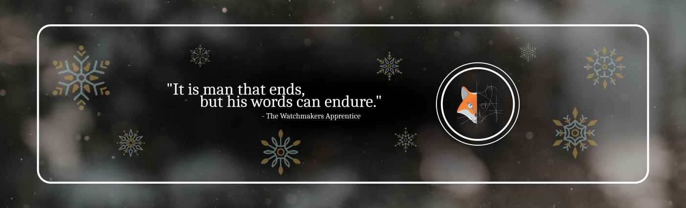

# 🇱🇰 Welcome to Asanka's GitHub Profile

> An Associate Embedded Engineer working in the field of Embedded Engineering

## ✒️ About Me

 Asanka is an Embedded Engineer with one year of experience in the industry. Graduate from SLTC Research University, Asanka specializes in Electronics and Telecommunication Engineering. This is fuelled by a passion for all things electronics and experience in firmware development, hardware design and IoT integrations. The experience provides Asanka with a keen sense of managing projects, optimizing hardware designs and writing memory-safe code. 

 

  

**Skills:** ⚡ Electronic Engineering | 📟 FPGA and HDL | 💿 Firmware Development | 🖥️ Hardware Design | 💾 Scripting

- ⛑️ Working as an Associate Embedded Engineer at [SenzMate IoT Intelligence](https://www.senzmate.com/)
- 🎓 Graduate in BSc. in Engineering in Electrical, Electronic and Telecommunication at [SLTC Research University](https://sltc.ac.lk/)
- 🌃 Co-creator of [Project Almanac](http://www.projectalmanac.org/)
- 💿 An avid C/C++ and Rust firmware development
- 🖥️ A keen PCB and hardware developer
- 📮 A huge proponent of open-source
- 🎵 Appreciates good art and music
- 📧 Reach me with my email: [akashsovis@gmail.com](mailto:akashsovis@gmail)
- 🌎 Visit my Website: [asankasovis.github.io](https://asankasovis.github.io/)
- 🌲 Go through my Linktree: [Go [through my ](https://linktr.ee/asankasovis)Linktree](https://linktr.ee/asankasovis)
- 💸 Donations: [Paypal](https://www.paypal.com/donate/?hosted_button_id=4EWXTWQ9FUFLA)

## 💜 Social Media

💜 Asanka shares interesting things related to electronics, tech and programming on all major social media. Asanka is also keen on sharing his work, not to mention the blog posts he writes. The content doesn't end there, check the links below to take a look.

[
](https://www.facebook.com/artist.artist.98)          
            

> Also, drop a [quick message](https://tr.ee/GbXYISHOTX), I'll try to reply as soon as possible.

## 🐾 Github Footprint

🐾 Asanka is passionate about sharing his knowledge with others. As a proponent of open source, he also shares most of his work online for the reference of others. He hopes that others might with the work useful and will do greater things with them. The following metrics are a testament to that effort.

## 📈 Github Performance

📈 Asanka does his best to keep a healthy work-life balance. Since he's working full-time as an Embedded Engineer, he sometimes finds it hard to keep all other aspects of his life in balance which sometimes results in a decline in Github activity. However, he does his best to keep this balance and not disrupt the flow.

## 🏆 Github Achievements
🏆 With the free time Asanka has, he always tries to do something valuable for himself and others. The content he uploads to GitHub has allowed him to achieve quite a lot within a very small amount of time. These small achievements make him motivated to continue expanding his skillset and to share more and more with others on the internet. The hope is that he's able to continue this throughout his journey as an engineer. Check out some of the achievements below.

## 🗝️ Key Languages

🗝️ Asanka is interested in a variety of fields. He finds himself comfortable mostly in Embedded Development. However, he's interested in scripting, HDL and creative design as well. On the other hand, he also does reverse engineering, technology research and blogging. Eventhough not his strong point, he's also capable of working on web development. Go through the following to get a better understanding of his skill set.

    <table>
        <tr>
            <td>💾 C/C++</td>
            <td>🦀 Rust</td>
            <td>📟 Assembly</td>
            <td>🐍 Python</td>
            <td>🔧 Verilog</td>
            <td>💻 Visual C#</td>
            <td>💲 Bash</td>
            <td>🍵 Java</td>
        </tr>
        <tr>
        </tr>
        <tr>
            <td>💻 Visual Basic</td>
            <td>🐘 PHP</td>
            <td>📃 JavaScript</td>
            <td>🖌️ CSS</td>
            <td>📦 Solidity</td>
            <td>🐬 MySQL</td>
            <td>➕ Matlab</td>
            <td>📚 Latex</td>
        </tr>
    </table> 

 
## 💡 Highlight Projects

💡 These are some of the projects that Asanka is proud of. He puts a lot of effort into them since they can improve his knowledge of certain technologies while acting as a starting point for others to build great things. He plans to add more projects to this list and to continue developing these even further.

### 01. 💻 Eight Bit Computer Using FPGA
This project is trying to recreate the eight-bit computer that [Ben Eater](https://www.youtube.com/c/BenEater) created in his famous YouTube[ series](https://www.youtube.com/playlist?list=PLowKtXNTBypGqImE405J2565dvjafglHU). However, the difference is that here, the intended use is of FPGAs and the Verilog HDL for this task. The goal was to use this as a learning opportunity to sharpen the knowledge in FPGAs and Verilog.
- *Key Technologies* - 𓇲 Verilog | 𓇲 HDL
- *Status* - 🔄 working
- *Repository* - [eight_bit_computer](https://github.com/asankaSovis/eight_bit_computer)

### 02. 🔐 Muragala Password Manager
The goal of this project is to create a safe yet simple password manager that is easy to use. With this goal in mind, both a Python CLI, a C# library as well and a C# CLI application is created. Working is also currently on the way on a GUI application based on the C# library. These projects will also continue to improve and more functionalities will also be added in the future.
- *Key Technologies* - 🐍 Python | 🖥️ Visual C#
- *Status* - 🔄 working
- *Repository* - [password-manager-Python](https://github.com/asankaSovis/password-manager-Python) | [password-manager-CSharpLibrary](https://github.com/asankaSovis/password-manager-CSharpLibrary) | [password-manager-CSharpGUI](https://github.com/asankaSovis/password-manager-CSharpGUI)

### 03. 🔥 Prometheus Fire Alarm System
This project was intended to create a next-generation fire alarm system that is both robust and smart. It can successfully detect and even extinguish fires while also giving full control to the operator remotely. The command panel even can manage multiple of these fire alarm modules which gives the building much better safety when it comes to fire hazards. I have even uploaded a demonstration to YouTube that shows the fire alarm system in action.
- *Key Technologies* - 💿 C++ | 🖥️ Visual C# | ♾️ Arduino | 𓇲 Nordic Semicon | 🖧 Matter Network
- *Status* - ✅ done
- *Repository* - [prometheus-fire-alarm](https://github.com/asankaSovis/prometheus-fire-alarm) | [prometheus-command-panel](https://github.com/asankaSovis/prometheus-command-panel) | [Project-Prometheus-v2.0](https://github.com/asankaSovis/Project-Prometheus-v2.0)

### 04. 📩 BitStreamer
BitStreamer is a data streaming software developed for communication engineers to send a bit stream from one COM port and check how many bits can be received back from another COM port. Here, the bitstream from the first COM port can be sent through a communication medium to check the efficiency of the communication medium.
- *Key Technologies* - 💿 C++ | 🖥️ Visual C# | ♾️ Arduino
- *Status* - ✅ done
- *Repository* - [BitStreamer](https://github.com/asankaSovis/BitStreamer)

### 05. 📚 Project Akaradiya
Building a database of Sinhala definitions for an English dictionary using crowd-sourcing. Anyone can create an account using their email. They can later add words to the dictionary, add definitions to the existing words, and vote for the best definition from currently existing definitions that others have added.
- *Key Technologies* - ⌨️ JavaScript | 📱 HTML | 🐘 PHP | 🎨 CSS
- *Status* - ✅ done
- *Repository* - [Project-Akaradiya](https://github.com/asankaSovis/Project-Akaradiya)

### 06. 📌 Indoor Positioning System
The idea of this project is to build a system that uses the existing lights to detect the location of a user within an indoor environment. For this, we can use Visible Light Communication (VLC) technology. The basic concept is to have four LEDs transmitting their IDs one after the other at fixed intervals. The receiver can receive the IDs identify how the intensity differs between each LED and decide its position within an environment.
- *Key Technologies* - 𓇲 Verilog | ♾️ Arduino | 🖥️ Visual C#
- *Status* - ✅ done (Documenting...)
- *Repository* - [Position_Detection](https://github.com/asankaSovis/Position_Detection)

### 07. 🚘 Metroparking
The main problem identified for this project is the inefficiency of parking implementations. Metro parking is a next-level smart parking system that automates the process of reserving, paying and managing parking services in urban parking providers. It is an IoT-based project that uses electronics, and autonomous and cloud technologies to create a fully automated system to handle parking.
- *Key Technologies* - ⌨️ JavaScript | 📱 HTML | 🐘 PHP | 🎨 CSS | ♾️ Arduino | 🖥️ Visual C#
- *Status* - ✅ done
- *Repository* - [Metroparking](https://github.com/asankaSovis/Metroparking)

### 08. 📡 Bidirectional Transciever
This project was intended to develop a bidirectional transmitter and receiver device that uses Visible Light Communication (VLC) technology to transmit and receive data from one device to another. In its basic form, data is transmitted as pulses of light where on means bit 1 and off means bit 0. This can be paired with more complicated transmitting techniques to build much more accurate and sophisticated data transmission.
- *Key Technologies* - 𓇲 Verilog | 💿 C/C++
- *Status* - ✅ done (Documenting...)
- *Repository* - [Bidirectional_Transmitter](https://github.com/asankaSovis/Bidirectional_Transmitter)

### 09. 🤖 Project Bionic
Project Bionics intends to build a bio-inspired robot that can mimic nature. The design, based on the 3D models shared by KILIC on PCBWay, can mimic the movement of a spider by using servos. The complete system is controlled by a NodeMCU and is powered by a Li-ion battery which makes it portable. The robot can move to the front and back and can rotate to the left and right.
- *Key Technologies* - 💿 C/C++
- *Status* - ✅ done
- *Repository* - [Project_Bionic](https://github.com/asankaSovis/Project_Bionic)

### 10. 📒 Stick It!
Stick It! is a basic note-organizing app that can be used to store and pin notes to the screen. Similar to the Microsoft Sticky Notes, this can be used to write simple notes quickly and easily. Unlike Sticky Notes, this supports markdown and also has the functionality to pin the notes on top of other windows.
- *Key Technologies* - 🖥️ Visual C#
- *Status* - ✅ done (Documenting and Improving...)
- *Repository* - [Stick It!](https://github.com/asankaSovis/Stick-It)

### 11. 🌃 Project Almanac
In this project, the plan was to use a distributed HPC algorithm to enhance timetable scheduling. Since efficiently distributing events across a timetable is an important part of the world to efficiently manage our day-to-day tasks, this project is crucial for the future of efficient timetable allocation. With the use of HPC, we intend to increase efficiency and find the optimal solution to this problem.
- *Key Technologies* - 🖥️ Visual C# | 🐍 Python | 🖥️ Beowulf Cluster | 🖥️ High Performance Computing (HPC) | 🤖 Artificial Intelligence
- *Status* - 🔄 working
- *Project Website* - [Project Almanac](http://www.projectalmanac.org/)

---

 

> Check out my [Fiverr](https://www.fiverr.com/s2/e49d0013dd)

***Made with ❤️ in  Sri Lanka***

© 2024, Asanka Sovis 
 

